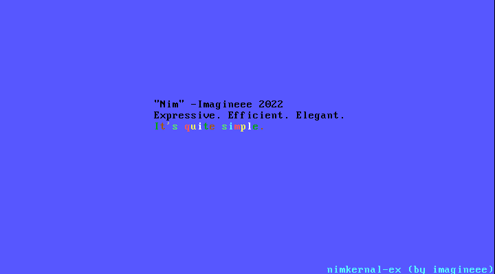

<h1 align="center">nimkernel-ex(tended)</h1>

This is a small 32bit (i686) kernel written using the Nim programming language, a fork of [dom's nim kernal](https://github.com/dom96/nimkernel).

It's main difference here is the small tweaks and enhancements like adding a background option to rainbow text and a windows build system.

Features:
* A ``writeString`` function which shows a string on screen in a specified
  position.
* A ``rainbow`` function which shows a string with a rainbow-like text
  foreground colour differentiation in a specified position.
* Some simple error handling by implementing Nim system.nim's ``panic``
  function.
* Support for 16 colors with a brilliant type safe API!



## Setup

You are required to have:

* QEMU
* a C and asm cross-compiler for i686
* Nim 1.6.0 or higher
* nimble (*)

\* You can always grab the nake library manually from [here](https://github.com/fowlmouth/nake).

### Building a cross compiler
This is done on a Linux machine, I haven't tried it yet. I think [this repo](https://github.com/lordmilko/i686-elf-tools#i686-elf-tools) might help for compiling on other platforms but not tested.

For more information take a look at the [OSDev article](http://wiki.osdev.org/GCC_Cross-Compiler).

You will need to download the source of binutils and gcc.

First ``cd`` into a suitable directory in which you would like to download, unzip
and build the cross compiler. Then perform the following actions:

```bash
$ wget https://ftp.gnu.org/gnu/binutils/binutils-2.37.tar.xz
$ tar -xJf binutils-2.37.tar.xz
$ cd binutils-2.37
$ mkdir build && cd build
$ ../configure --target=i686-elf --prefix=$HOME/cross-tools/ --with-sysroot --disable-nls --disable-werror
$ make -j$(nproc)
$ make install
```

You may then grab the GCC source and build it:

```bash
$ wget https://ftp.gnu.org/gnu/gcc/gcc-11.2.0/gcc-11.2.0.tar.xz
$ tar -xJf gcc-11.2.0.tar.xz
$ cd gcc-11.2.0
$ mkdir build && cd build
$ ../configure --target=i686-elf --prefix=$HOME/cross-tools/ --disable-nls --enable-languages=c --without-headers
$ make all-gcc -j$(nproc)
$ make all-target-libgcc -j$(nproc)
$ make install-gcc
$ make install-target-libgcc
```

You should then have a i686-elf-gcc and i686-elf-as executable in $HOME/cross-tools/bin/ or somewhere thereabouts.
You should then add it to your PATH permanently or temporarily by doing:

```bash
export PATH=$PATH:$HOME/cross-tools/bin
```

### Downloading cross compiler binaries (Windows & Linux)

If you want prebuilt binaries, get them from here [https://github.com/lordmilko/i686-elf-tools/releases](https://github.com/lordmilko/i686-elf-tools/releases)

Please note that these are a bit outdated but they are confirmed to work.

You would want to put the `bin` folder somewhere and add it to you `PATH` variable on windows and Linux.

There seems to be also a x64 toolchain, so we can try compiling this for x64 in the future.

### Nim setup

Follow the instructions in on the [Nim Website](https://nim-lang.org/install.html) to install Nim.

Install `nake` by running `nimble update && nimble install nake`.

You can then compile the nakefile and therefore compile nimkernel:

```bash
# to build
nake build
# to run
nake run
# to rebuild and run
nake test
```

`Run` and `Test` automatically build and run the kernel using QEMU.

## License

Nimkernel-ex is licensed under the MIT license.

